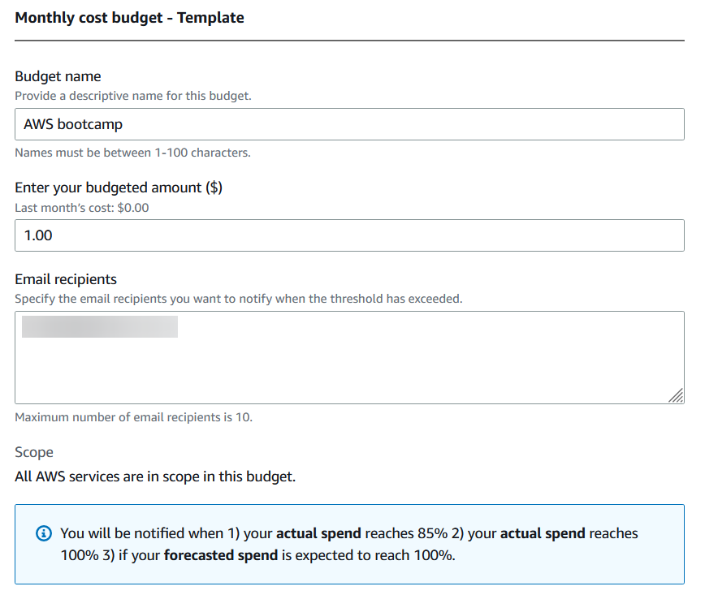
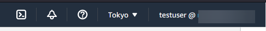
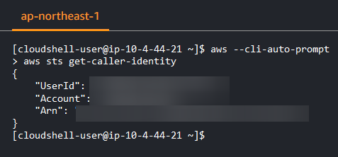

# Week 0 — Billing and Architecture

<!-- TOC -->
* [Week 0 — Billing and Architecture](#week-0--billing-and-architecture)
  * [Lucid Chart](#lucid-chart)
    * [Conceptual Diagram](#conceptual-diagram)
    * [Logical Architectual Diagram](#logical-architectual-diagram)
  * [Create a Budget](#create-a-budget)
  * [Create a Budget Alarm](#create-a-budget-alarm)
  * [Create an Admin User](#create-an-admin-user)
  * [Use CloudShell](#use-cloudshell)
  * [Generate AWS Credentials](#generate-aws-credentials)
  * [Installed AWS CLI](#installed-aws-cli)
<!-- TOC -->

## Lucid Chart

### Conceptual Diagram

[Link](https://lucid.app/documents/view/0af05386-47f0-4388-9e1a-4c6b165cc717)

### Logical Architectual Diagram

[Link](https://lucid.app/documents/view/c56dae33-e3ea-41e1-b356-f1f7e46b8f5f)

---

## Create a Budget

1. Go to the link below and click `Create Budget`.

   https://us-east-1.console.aws.amazon.com/billing/home#/budgets#/home

2. Enter the following Setup:

    1. Budget Setup - `Use a template (simplified)`

    2. Templates - `Monthly cost budget`

    3. Enter the budget name

    4. Enter your budgeted amount

    5. Enter the email recipients

   

   

3. Click the `Create Budget` to continue

And now we have a budget setup

## Create a Budget Alarm

1. Click the budget created, and then click the `edit`.

   

2. Leave the `Set your budget` as is for now and click `next`.

   

3. In the `Configure Alerts`, we can now set up the budget alarm. We can have different kinds of alarm set up here.

   

   

   

4. We can skip the `attach actions` for now and hit the `next` button.

5. Afterwards, we will review the created budget alarm and then hit `save` button

---

## Create an Admin User

1. Go to the `IAM` service by typing in the search bar of the AWS

   

2. In the sidebar, go to the users.

   

3. Click the `add users`

   

4. Add the `username` and the click the checkbox of the `Provide user access to the AWS Management Console - optional`
   to be able to create the IAM User. Followed by click the `I want to create an IAM user`

   

5. For now, we will leave it as `Autogenerated password` and then un-check
   the `Users must create a new password at next sign-in (recommended).` so that we could proceed normally when signing
   in. Afterwards hit the `next` button

   

6. Click the `Add user to group` and then `Create Group`

   

7. Search for the `AdministratorAccess` and select it, afterwards click the `Create user group` button.

   

8. Click the created group and hit the `next` button.

   

9. Review the created user, and the click the `Create User` button.

   

10. Now we will have the `Console sign-in URL` and then we can now view the autogenerated password.

   

11. Now we have created an admin user.

   

12. Return the `dashboard`.

   

13. On the right side, we can create an alias for our root account. In which in turn will change the Sign-in URL for our
    accounts

   

14. Now we can enter the alias of our root account.

   

   IAM users will still be able to use the default URL containing the AWS account ID.

15. Now we have successfully created an alias for our Sign-in URL link.
   
   

16. Using the console login url, add it to the browser.

   

17. Enter the username and password and now, we can log in to our created admin account.

   

---

## Use CloudShell

1. It looks like the `Singapore` region doesn't have the cloud shell

   

2. Switch to the `Tokyo` region, and now we can see the cloudshell. Click the Cloudshell button.

   
3. Enter the cloudshell.
   
   

   
4. Enter the `aws --cli-auto-prompt` in cloudshell and find the `aws sts get-caller-identity`

   

5. We can now see the information about our account.
   
   

---

## Generate AWS Credentials

---

## Installed AWS CLI